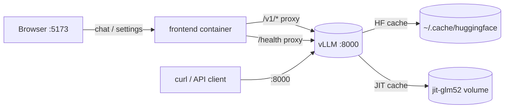

# Architecture

The stack runs vLLM as an OpenAI-compatible API and a React frontend that proxies to it. Everything is defined in `docker-compose.yml`.

## Services

| Service | Purpose |
|---------|---------|
| `glm52-vllm` | Default backend. Prebuilt SM120/B12X vLLM image serving GLM 5.2 with sparse MLA + NVFP4. |
| `glm52-vllm-stock` | Optional backend (profile `stock-patches`). Stock vLLM with runtime SM120 patches. |
| `frontend` | React/Vite chat UI. Proxies `/v1` and `/health` to the active backend. |

Only one backend runs at a time. `glm52-vllm` and `glm52-vllm-stock` both bind host port `8000` and use the same container name (`glm52-vllm`), so start them with the profile selector, not together.

## Request flow

The frontend dev server (Vite) proxies `/v1` and `/health` to `VLLM_PROXY_TARGET`, which is `http://glm52-vllm:8000` inside Compose. In local dev without Compose it falls back to `http://host.docker.internal:8000`.

## Backends

### B12X (default)

Uses `VLLM_IMAGE` (a prebuilt SM120-native vLLM build) and runs `backend/serve-b12x.sh` as its command. This image ships B12X sparse MLA, NVFP4 MoE, and fp8 GEMM kernels built for SM120, so no runtime patching is needed.

### Stock + patches (`stock-patches` profile)

Builds `backend/Dockerfile` from `vllm/vllm-openai:latest` and runs `backend/entrypoint.sh`, which applies `backend/apply_sm120_patches.py` before `vllm serve`. The patches disable DeepGEMM paths that lack SM120 kernels and add PyTorch fallbacks for the MLA indexer. Sparse MLA support is incomplete here; use it for experimentation only.

See [vLLM deployment](features/vllm-deployment.md) for serve flags and the patch list.

## Volumes and caching

| Mount | Purpose |
|-------|---------|
| `~/.cache/huggingface` -> `/root/.cache/huggingface` | Model weights (shared with host HF cache) |
| `jit-glm52` -> `/cache/jit` | JIT compilation cache (Triton, FlashInfer, TVM, torch extensions) |

The JIT cache volume speeds up restarts after the first boot. `shm_size` is set to 32 GB and IPC uses host mode for multi-GPU NCCL.
